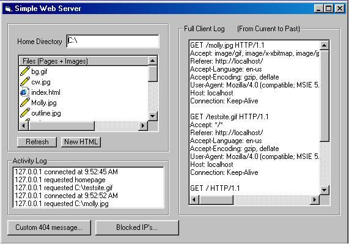



## Simple Web Server V2 \(a full webserver\!\)

### Description

Version 2 of my simple webserver (The code is simple, but the server can do much more) Features include Root directory customizing and a better HTML editor, Custom 404 error messages, Simple activity log, Full Client Log (what the browser sends to the server), and IP address blocking. If you like this, please vote for me ;)
 
### More Info
 

             |
---                |---
**Submitted On**   |2002-02-03 10:00:12
**By**             |[Matt Carpenter](https://github.com/Planet-Source-Code/PSCIndex/blob/master/ByAuthor/matt-carpenter.md)
**Level**          |Intermediate
**User Rating**    |4.3 (13 globes from 3 users)
**Compatibility**  |VB 6\.0
**Category**       |[Internet/ HTML](https://github.com/Planet-Source-Code/PSCIndex/blob/master/ByCategory/internet-html__1-34.md)
**World**          |[Visual Basic](https://github.com/Planet-Source-Code/PSCIndex/blob/master/ByWorld/visual-basic.md)
**Archive File**   |[Simple\_Web52605232002\.zip](https://github.com/Planet-Source-Code/matt-carpenter-simple-web-server-v2-a-full-webserver__1-31452/archive/master.zip)

